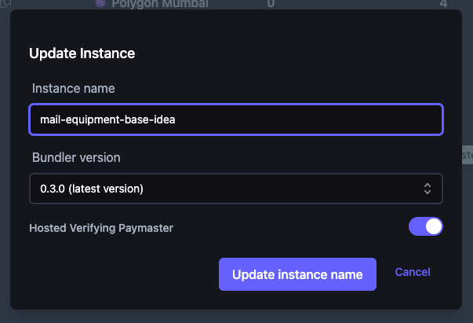

# Introduction

Account abstraction with ERC-4337 enable special entities called **paymasters**. These are third-parties that can sponsor the gas for an account if their conditions are met. This enables account holders to pay for transaction fees in many different ways without resulting to custodial solutions.

## Running a paymaster

The protocol allows anyone to build a paymaster from scratch and start sponsoring UserOperations as long as it complies with the standard. At a high level this process involves:

- Building and deploying a paymaster contract.
- Depending on the storage access and opcodes used during validating, paymasters may need to also:
  - Stake with the EntryPoint of each supported network.
  - Use a alternate mempools supported by specific bundlers.
- Maintain enough deposits with supported EntryPoints to make sure it can serve the volume of sponsored transactions.

## Common types of Paymasters

The standards are flexible enough to support any type of gas abstraction. Here are some common high level use cases that are most often referred to.

### Verifying Paymaster

Sample implementation: [VerifyingPaymaster.sol](https://github.com/eth-infinitism/account-abstraction/blob/develop/contracts/samples/VerifyingPaymaster.sol)

These are paymasters that provide gas abstractions linked to an off-chain process. For example, it can enable user's to pay for their transaction fees with a credit card or subscription service without sacrificing custody of their account. In this scenario, the paymaster that sponsors the gas will also sign the UserOperation if it meets their business logic.

### Deposit Paymaster

Sample implementation: [DepositPaymaster.sol](https://github.com/eth-infinitism/account-abstraction/blob/develop/contracts/samples/DepositPaymaster.sol)

These are paymasters that provide gas abstractions linked to an ERC-20 token on-chain. For example, without account abstraction, a user who wants to send USDC will need to hold both the stablecoin and ETH in order to pay the transaction fee. This changes with the deposit paymaster as it can enable users to pay their transaction fees in USDC only and not have to hold any ETH.

And because ERC-20 is a widely adopted standard, this can also work with any other token the paymaster chooses to support.

## Stackup Paymaster API

If you're looking to get started with gas abstraction quickly, Stackup provides simple Plug-n-Play APIs for common types of paymaster use cases. Refer to the table below for a list of supported Paymaster services we currently offer.

**The following APIs are only available on the Developer plan. Make sure to enable them via your dashboard.**

### PAYG (pay as you go)

Gas will be fully covered for valid UserOperations and the value will be billed to your monthly invoice with Stackup. These are based on the [Verifying Paymaster](#verifying-paymaster) contract.

Refer to the table below and the [rpc methods](./rpc-methods) page for integration details.

| EntryPoint used                                                                                                                                              | RPC endpoint                                     |
| ------------------------------------------------------------------------------------------------------------------------------------------------------------ | ------------------------------------------------ |
| [0x0576a174D229E3cFA37253523E645A78A0C91B57](https://blockscan.com/address/0x0576a174D229E3cFA37253523E645A78A0C91B57) (or bundler version v0.4)             | `app.stackup.sh/api/v2/paymaster/payg/<API_KEY>` |
| [0x0F46c65C17AA6b4102046935F33301f0510B163A](https://blockscan.com/address/0x0F46c65C17AA6b4102046935F33301f0510B163A) (or bundler version v0.3)1 | `app.stackup.sh/api/v1/paymaster/payg/<API_KEY>` |

1. Only available on Goerli.
