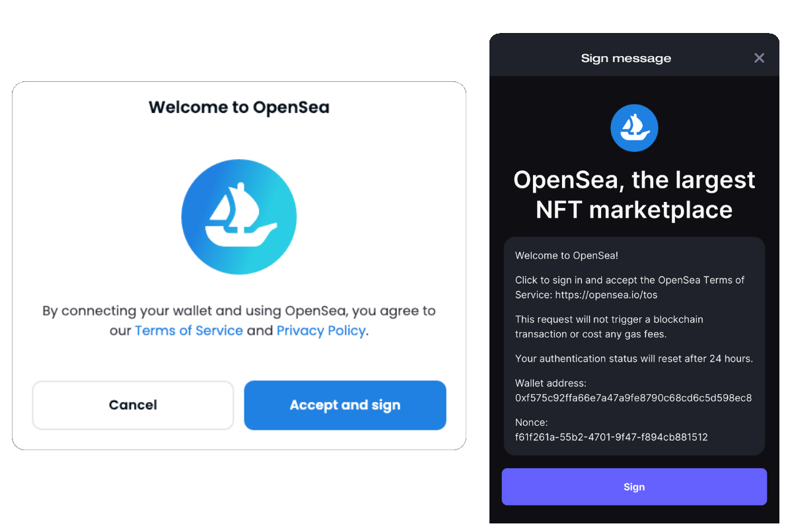
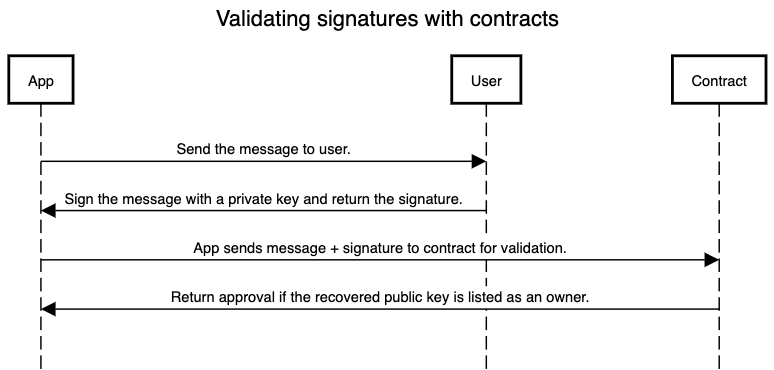

# Validating signatures

A contract account enables arbitrary verification logic that can support multisig and any signature scheme. This is an advantage over an EOAs which limits users to only ECDSA.

## Validating signatures with contracts

An EOA can use it's private key to sign messages. However, a contract account isn't inherently associated to a private key so it cannot sign messages by default.

But let's say your smart contract is assigned an owner that holds an arbitrary private key. The contract can still be programmed to verify that a message was signed by the current owner's private key. This can also be extended for multisig cases as well with many owners.

## Example: signing up for an app with a smart contract account

Let take a look at the example of signing up to an app like [OpenSea](https://opensea.io/) with a smart contract account like [Stackup](https://www.stackup.sh/). Below is the following flow that you're likely familiar with.



Here you are verifying that you own the account you are signing up with. And this is what happens under the hood:



**Essentially, the contract has some logic to ensure that the message has been signed by the correct users or entities before approving anything.**

## A standard to ensure interoperability

In order for this to work with multiple different parties, it's important to follow the recommended standard as outlined in [EIP-1271](https://eips.ethereum.org/EIPS/eip-1271).

**As the developer this means making sure your smart contracts implements the following interface:**

```solidity
abstract contract ERC1271 {
  bytes4 internal constant MAGICVALUE = 0x1626ba7e;

  function isValidSignature(bytes32 _hash, bytes memory _signature)
    public
    view
    virtual
    returns (bytes4 magicValue);
}

```

:::tip

Implementing this standard is the easiest way to ensure your smart contract accounts have the best coverage for validating signatures with the rest of the ecosystem.

:::
