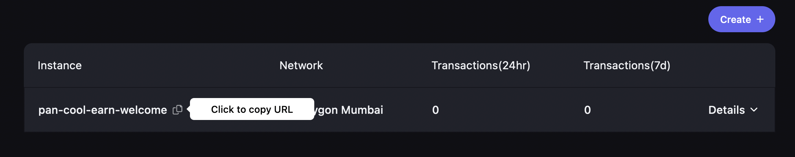

# Quickstart

Explore a basic implementation of account abstraction using ERC-4337. This example will create an account and initiate a transaction on the Ethereum Goerli testnet.

If you are new to account abstraction, we recommend the [introduction to account abstraction](/docs/introduction/account-abstraction) and an [overview of ERC-4337](/docs/introduction/erc-4337-overview).

<div align="center" width="100%" class="video"><iframe width="100%" height="100%" src="https://www.youtube.com/embed/zvnm2GnMAts" title="YouTube video player" frameborder="0" allow="accelerometer; autoplay; clipboard-write; encrypted-media; gyroscope; picture-in-picture" allowfullscreen></iframe></div>

## 1. Download

Clone the [ERC-4337 Examples](https://github.com/stackup-wallet/erc-4337-examples) repository to download the scripts.

```
git clone https://github.com/stackup-wallet/erc-4337-examples.git
```

## 2. Install

This example uses the [Infinitism](https://github.com/eth-infinitism/account-abstraction) package created by the ERC-4337 core developers. Install it, and all other dependencies.

```
yarn install
```

## 3. Initialize your configuration

You can now initialize your local configuration.

```
yarn run init
```

A `config.json` file will be created. The file will look like this:

```
{
  "bundlerUrl": "http://localhost:4337",
  "rpcUrl": "http://localhost:8545",
  "signingKey": "0x...",
  "entryPoint": "0x...",
  "simpleAccountFactory": "0x...",
  "paymasterUrl": ""
}

```

If you are not running a local [bundler](https://github.com/stackup-wallet/stackup-bundler) or network node, you will need to set a `bundlerUrl` and `rpcUrl`.

You can create a free bundler instance at [app.stackup.sh](https://app.stackup.sh/sign-in). In this example, select the Ethereum Goerli network for the instance and ensure the version is set to `0.3.0`. Once the instance is created, copy the instance URL and replace the default `bundlerUrl` with the generated address.



The `rpcUrl` can be set to any network node. This example is on the Ethereum Goerli testnet, so you can use a public endpoint such as https://endpoints.omniatech.io/v1/eth/goerli/public or your own.

Your `config.json` fill will now look like this:

```
{
  "bundlerUrl": "https://node.stackup.sh/v1/rpc/...",
  "rpcUrl": "https://endpoints.omniatech.io/v1/eth/goerli/public",
  "signingKey": "0x...",
  "entryPoint": "0x...",
  "simpleAccountFactory": "0x..."
  "paymasterUrl": ""
}

```

## 4. Create an account

Create an account using the factory `simpleAccountFactory` defined in the configuration file.

```
yarn run simpleAccount address
```

An address will be returned. At this point, the smart contract account has not been deployed.

## 5. Fund the account

Deposit ETH into the account on Goerli.

Navigate to a faucet, such as https://goerlifaucet.com/. Enter the account address and claim the testnet ETH.

:::info

Faucets do not send directly to smart contracts. You must deposit ETH or ERC-20 tokens from the faucet before your first transaction.

:::

## 6. Initiate the transfer

The `simpleAccount transfer` command allows you to transfer MATIC from the smart contract account to any address. It will create a user operation, sign it, and send it to the bundler:

```
yarn run simpleAccount transfer --to <address> --amount <eth>
```

You can then find the transaction using a block explorer like [etherscan](https://goerli.etherscan.io/).

## With paymaster

All commands also have a optional `--withPaymaster` flag. This will send your user operations to the `paymasterUrl` specified in your config. If you are using Stackup's paymaster, the `paymasterUrl` will be the same as the `bundlerUrl` but at the paymaster endpoint.

For example, if `bundlerUrl` is:

```
"bundlerUrl" = "https://node.stackup.sh/v1/rpc/<API key>"
```

Then your `paymasterUrl` is:

```
"paymasterUrl" = "https://app.stackup.sh/api/v1/paymaster/payg/<API key>"
```

Regardless of whether you use Stackup's paymaster service or not, the endpoint is expected to implement a standard [JSON-RPC interface](../api/paymaster/rpc-methods) and return back a `paymasterAndData` field if it agrees to sponsor your transaction.

**With this option, you can execute any transaction without needing to hold ETH or MATIC for gas fees.**

```
yarn run simpleAccount transfer --to <address> --amount <eth> --withPaymaster
```

:::info

If you are on a Stackup developer plan, you can get quick access to our hosted [Paymaster APIs](../api/paymaster/introduction#stackup-paymaster-api).

:::

## That's it!

You've successfully sent a transaction using a smart contract account and ERC-4337. Now that you've done a simple transfer with your account, you can also check out other commands in the example.

- [Transfer ERC-20 tokens](https://github.com/stackup-wallet/erc-4337-examples#transfer-erc-20-token)
- [Batch transfer ETH](https://github.com/stackup-wallet/erc-4337-examples#transfer-erc-20-token)
- [Batch transfer ERC-20 tokens](https://github.com/stackup-wallet/erc-4337-examples#transfer-erc-20-token)
