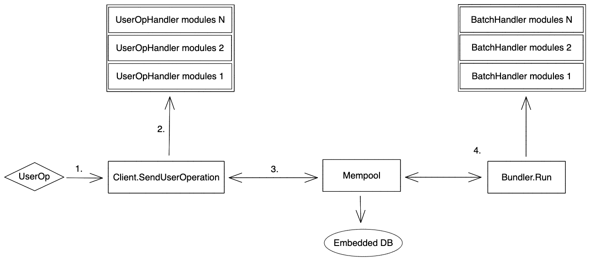

# Go integration

Besides running as a standalone service, the bundler is built with packages that can be ported into other Golang based applications. This is useful for Golang based block builders who want to support EIP-4337.

## Adding the dependency

To get started, add the the `stackup-bundler` package to your project using Go modules (version 1.16+ required).

```bash
go get -u github.com/stackup-wallet/stackup-bundler
```

### Go docs

All packages that can be imported live in the `pkg` directory. The full Go documentation of all available packages can be found [here](https://pkg.go.dev/github.com/stackup-wallet/stackup-bundler/pkg).

```go
import "github.com/stackup-wallet/stackup-bundler/pkg/..."
```

## Concepts

On a high level the `stackup-bundler` is based around a few core packages. This section will give a quick overview to make diving into the Go documentation and source code more productive.

:::info
Check the code for [setting up a standalone private bundler](https://github.com/stackup-wallet/stackup-bundler/blob/main/internal/start/private.go) as a concrete example of how these packages are used in practice.
:::

### `userop`

[pkg.go.dev/github.com/stackup-wallet/stackup-bundler/pkg/userop](https://pkg.go.dev/github.com/stackup-wallet/stackup-bundler/pkg/userop)

```go
import "github.com/stackup-wallet/stackup-bundler/pkg/userop"
```

The `userop` package provides the struct for an ERC-4337 style transaction. This is the core data structure that is used throughout all the other packages within the `stackup-bundler`.

### `mempool`

[pkg.go.dev/github.com/stackup-wallet/stackup-bundler/pkg/mempool](https://pkg.go.dev/github.com/stackup-wallet/stackup-bundler/pkg/mempool)

```go
import "github.com/stackup-wallet/stackup-bundler/pkg/mempool"
```

The `mempool` package provides a pool of all UserOperations that are known to the bundler. A UserOperation that enters the mempool is assumed to have passed all relevant checks by the [`client`](#client). The `mempool` is also backed by an embedded database ([badgerDB](https://github.com/dgraph-io/badger)) to provide persistance through server resets.

### `client`

[pkg.go.dev/github.com/stackup-wallet/stackup-bundler/pkg/client](https://pkg.go.dev/github.com/stackup-wallet/stackup-bundler/pkg/client)

```go
import "github.com/stackup-wallet/stackup-bundler/pkg/client"
```

The `client` package acts as a mediator that controls the processing of incoming UserOperations to make sure they are valid before adding it to the [`mempool`](#mempool). The `client` is also required to be flexible enough to run in many different modes and can be customized in how it processes incoming UserOperations with the use of standardized [modules](#modules).

### `bundler`

[pkg.go.dev/github.com/stackup-wallet/stackup-bundler/pkg/bundler](https://pkg.go.dev/github.com/stackup-wallet/stackup-bundler/pkg/bundler)

```go
import "github.com/stackup-wallet/stackup-bundler/pkg/bundler"
```

The `bundler` package acts as another mediator that controls the process of batching UserOperations from the [`mempool`](#mempool) and sending them to the EntryPoint. The `bundler` is also required to be flexible enough to run in many different modes and can be customized in how it processes outgoing batches with the use of standardized [modules](#modules).

### `modules`

[pkg.go.dev/github.com/stackup-wallet/stackup-bundler/pkg/modules](https://pkg.go.dev/github.com/stackup-wallet/stackup-bundler/pkg/modules)

```go
import "github.com/stackup-wallet/stackup-bundler/pkg/modules"
```

The `modules` package provides standard interfaces for extending instances of the [client](#client) and [bundler](#bundler) with middleware to process UserOperations and batches.

## Architecture

Right away we can see that the architecture of the `stackup-bundler` is similar to what we see in the [ERC-4337 overview](../../introduction/erc-4337-overview.md#architecture) plus a few extra boxes that is worth mentioning in this context.



1. **The UserOperation reaches the client through any arbitrary transport layer (e.g. HTTP or P2P).**

2. **The client validates the UserOperation:**

   1. Checks the EntryPoint is supported.
   2. UseOperation has the correct schema.
   3. There are no duplicates in the mempool or it has high enough gas to replace it.
   4. Sends the UserOperation through the middleware stack for processing.

3. **UserOperation is added to the mempool. The mempool will also save it in an embedded DB for persistence.**

4. **In a separate goroutine, the bundler will run a repeated process:**

   1. Queries the mempool for new batches.
   2. Sends the batch through the middleware stack for processing.
   3. Removes processed UserOperations from the mempool.
